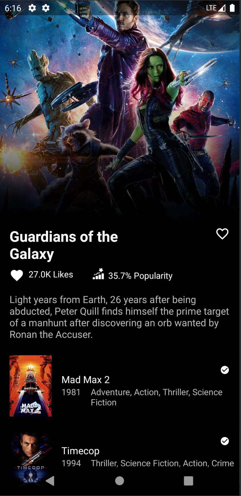

# TheMovie

## About Project

This app was developed through a challenge. In addition to the resources required by the challenge, others were added such as:
- Pull to refresh
- Icon Animated
  * Shape Shifter
  * AnimatedVectorDrawable
- Material Design
  * Snackbars

## API TheMovie DB

This app consumes a API REST, for more information visit the link: https://developers.themoviedb.org/3/getting-started/introduction

## Specifications and Technologies

- 100% Kotlin
- Modular Architecture
- Clean Architecture
- Domain-Drive Design (DDD)
- Design Patterns
- View Binding
- Android Jetpack 
  * Navigation
  * Live Data
- RX java
- Retrofit 2  
  * Interceptor OkHttp3
  * Converter Moshi
- Depedence Injection :syringe: Dagger 2

## Installers

If you want to test the App in the Production mode, the installers are listed below:

[Android.apk installer](https://drive.google.com/file/d/1o3iSaSDMwblOvbk6vJTWFJADyagZUGWq/view?usp=sharing)

## Built With

- [Android-Studio](https://developer.android.com/studio/preview?hl=pt) - Official native android development IDE

## License

This project is licensed under the MIT License - see the [LICENSE.md](https://github.com/steniowagner/mindCast/blob/master/LICENSE) file for details

 

 

 
